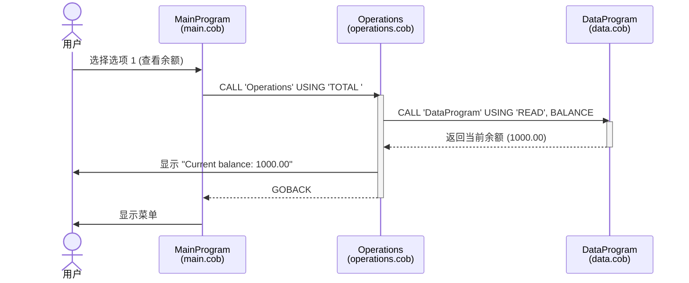
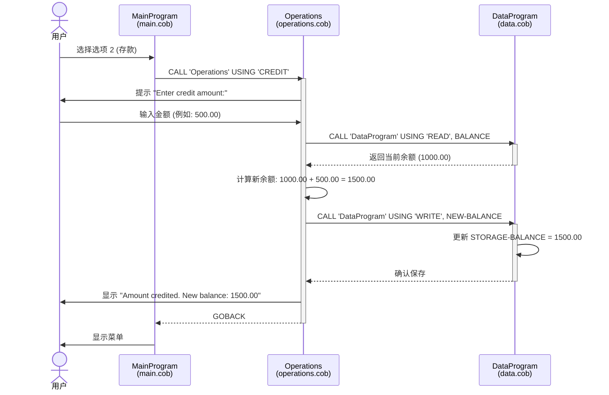
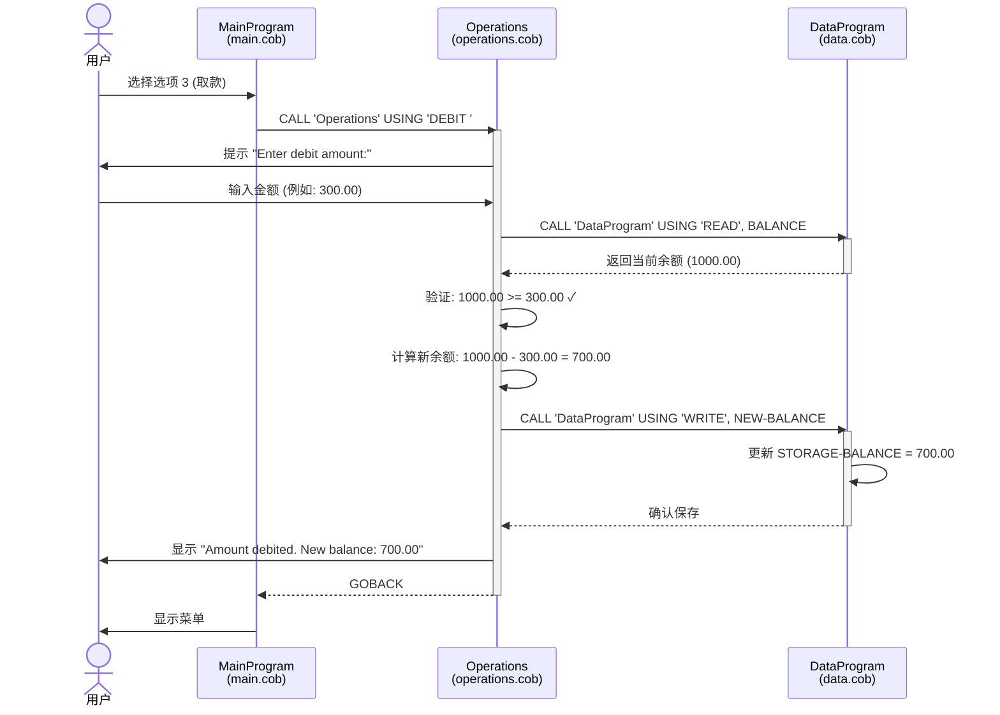
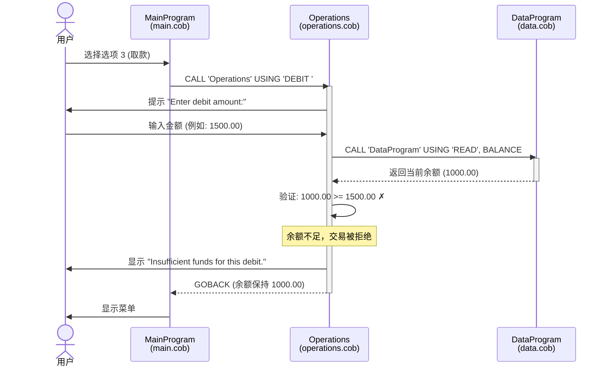

# COBOL 账户管理系统文档

## 概述

这是一个用 COBOL 编写的菜单驱动型账户管理应用程序。它允许用户查看余额、向账户存款和从账户取款，并内置了业务规则验证。

## 系统架构

系统由三个协同工作的主要 COBOL 程序组成：

- **main.cob**: 主程序控制器
- **operations.cob**: 业务逻辑和操作处理器
- **data.cob**: 数据持久化层

## 文件说明

### 1. main.cob (MainProgram)

**用途**: 作为账户管理系统的入口点和主控制器。

**主要功能**:

- 向用户显示交互式菜单
- 接受用户输入的操作选择
- 将请求路由到相应的操作处理器
- 控制主程序循环

**菜单选项**:

1. 查看余额 - 显示当前账户余额
2. 存款 - 向账户添加资金
3. 取款 - 从账户提取资金
4. 退出 - 终止程序

**数据结构**:

- `USER-CHOICE` (PIC 9): 存储用户的菜单选择
- `CONTINUE-FLAG` (PIC X(3)): 控制主程序循环 (YES/NO)

**控制流程**:

- 使用 `EVALUATE` 语句处理用户选择
- 使用适当的操作类型调用 `Operations` 程序
- 循环直到用户选择退出选项

---

### 2. operations.cob (Operations)

**用途**: 实现所有账户操作的核心业务逻辑。

**主要功能**:

#### 查看余额 (TOTAL)

- 从 DataProgram 检索当前余额
- 向用户显示余额

#### 存款 (CREDIT)

- 提示用户输入存款金额
- 检索当前余额
- 将存款金额添加到余额
- 保存更新后的余额
- 显示新余额

#### 取款 (DEBIT)

- 提示用户输入取款金额
- 检索当前余额
- **业务规则**: 在处理前验证是否有足够的资金
- 如果资金充足：减去金额并保存新余额
- 如果资金不足：显示错误消息并保持原余额
- 显示交易结果

**数据结构**:

- `OPERATION-TYPE` (PIC X(6)): 要执行的操作类型
- `AMOUNT` (PIC 9(6)V99): 交易金额（最大：999,999.99）
- `FINAL-BALANCE` (PIC 9(6)V99): 工作余额变量

**业务规则**:

1. **资金不足检查**: 如果请求金额超过当前余额，取款操作将被拒绝
2. **余额格式**: 所有货币值使用小数精度（2位小数）
3. **最大金额**: 交易不能超过 999,999.99

---

### 3. data.cob (DataProgram)

**用途**: 管理账户余额的数据持久化和存储。

**主要功能**:

#### 读取操作 (READ)

- 将当前存储的余额返回给调用程序
- 提供对账户数据的只读访问

#### 写入操作 (WRITE)

- 用新值更新存储的余额
- 持久化余额变更

**数据结构**:

- `STORAGE-BALANCE` (PIC 9(6)V99): 账户余额的持久化存储
  - **初始值**: 1000.00
  - **范围**: 0.00 到 999,999.99
- `OPERATION-TYPE` (PIC X(6)): 操作标识符 (READ/WRITE)

**链接段**:

- `PASSED-OPERATION`: 来自调用程序的操作类型
- `BALANCE`: 要读取或写入的余额值

**设计模式**: 充当简单的数据访问层，将数据存储与业务逻辑分离

---

## 业务规则摘要

### 账户余额规则

1. **初始余额**: 所有账户起始余额为 1,000.00
2. **余额范围**: 0.00 到 999,999.99
3. **精度**: 所有金额保持 2 位小数
4. **非负余额**: 系统防止余额变为负数

### 交易规则

1. **取款验证**:
   - 取款需要有足够的资金
   - 如果金额 > 当前余额，交易将被拒绝
   - 显示错误消息："Insufficient funds for this debit."（此次取款资金不足）

2. **存款处理**:
   - 没有上限验证（仅受数据类型最大值限制）
   - 只要在数据类型范围内，存款总是被接受

3. **余额显示**:
   - 余额查询不修改账户数据
   - 始终从存储中检索最新余额

### 数据完整性

- 余额更新是原子性的（读取、计算、写入）
- 没有并发访问控制（单用户系统）
- 数据仅在程序执行期间持久化（内存存储）

## 程序依赖关系

## 技术说明

### 使用的 COBOL 特性

- `CALL` 语句用于模块化程序设计
- `USING` 子句用于参数传递
- `LINKAGE SECTION` 用于程序间通信
- `EVALUATE` 用于菜单选择逻辑
- `GOBACK` 用于从被调用程序返回
- `PIC` 子句用于数据类型定义

### 局限性

1. **单账户**: 系统仅管理一个账户
2. **无持久化**: 程序重启后余额重置为 1000.00
3. **无交易历史**: 没有审计跟踪或交易日志
4. **无用户认证**: 没有账户安全或用户识别
5. **单线程**: 不支持并发用户

## 未来改进机会

- 实现基于文件的余额存储持久化
- 添加交易历史和审计日志
- 支持多用户账户
- 添加身份验证和授权
- 实现交易回滚能力
- 添加交易的日期/时间戳
- 包含交易参考号

## 系统序列图

以下序列图展示了应用程序中三个主要操作的数据流：

### 场景 1: 查看余额

### 场景 2: 存款操作

### 场景 3: 取款操作（成功）

### 场景 4: 取款操作（资金不足）

### 数据流要点

1. **主程序循环**: MainProgram 持续显示菜单，直到用户选择退出
2. **操作委托**: 所有业务逻辑都委托给 Operations 程序
3. **数据封装**: DataProgram 是唯一可以访问和修改余额存储的程序
4. **原子操作**: 每个交易都是读取-计算-写入的原子序列
5. **业务规则执行**: Operations 在写入数据前验证业务规则（如资金充足性）
